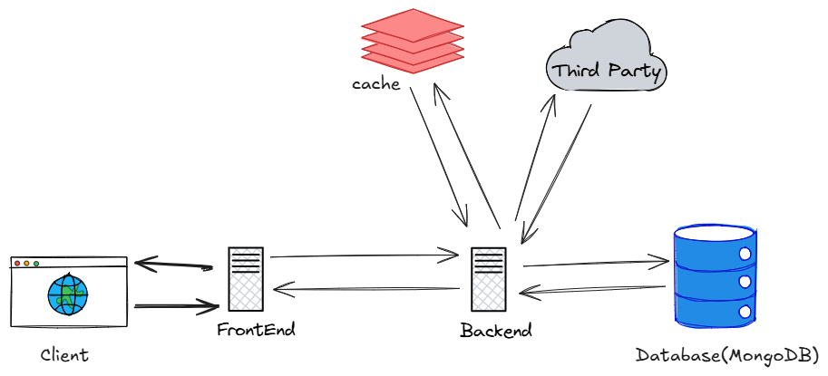
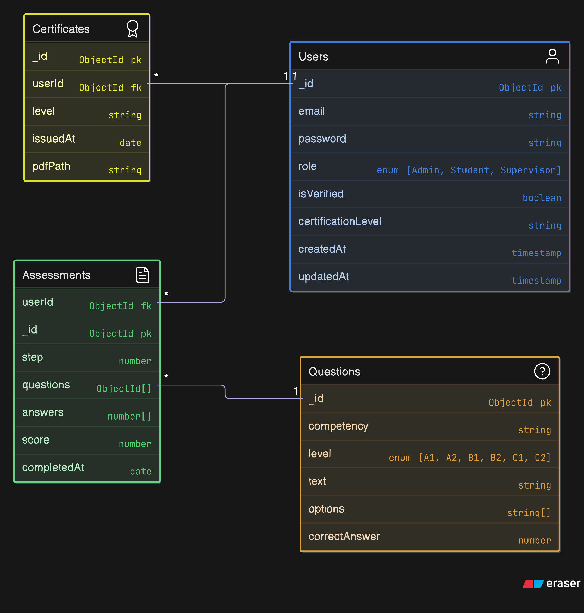

# Test_School Competency Assessment Platform

A modern, scalable digital competency assessment platform built with a TypeScript monorepo architecture using Turborepo. This system provides comprehensive functionality for students, supervisors, and administrators to assess and certify digital skills across levels A1 to C2, similar to standardized competency frameworks.

## 🌟 Features

- **🔐 Role-based Authentication**: Secure JWT-based authentication for Students, Supervisors, and Admins.
- **📝 Three-Step Assessment**: Progressive evaluation process for levels A1 to C2 with automated scoring and certification.
- **⏱ Timer System**: Configurable countdown timers with auto-submission on timeout.
- **📚 Question Management**: Admin-controlled question pool with 132 questions across 22 competencies and 6 levels.
- **📜 Certification**: Automatic certificate generation with optional PDF download and email delivery.
- **🏗️ Scalable Architecture**: Modular monorepo structure with shared packages for backend and frontend.
- **🛡️ Security**: Input validation, bcrypt password hashing, and optional Safe Exam Browser (SEB) integration.
- **📊 Admin Dashboard**: User and question management with pagination and configuration controls.

## 🏗️ Architecture

### Architectural Design

[]


This monorepo contains the following apps and packages:

### 📱 Applications

- **`backend`**: Express.js REST API with MongoDB integration
    - User authentication and authorization with JWT and OTP
    - Three-step assessment management with eligibility checks
    - Question pool management
    - Certificate generation and delivery
    - Admin panel APIs for user and question management
- **`frontend`**: React.js application (using Vite) for the user interface
    - Responsive design with Tailwind CSS
    - Role-based UI components (Student, Admin, Supervisor)
    - Real-time assessment progress and timer updates

### 📦 Shared Packages

- **`@repo/db`**: Database utilities and MongoDB connector with Mongoose

### ⚙️ Configuration Packages

- **`@repo/eslint-config`**: ESLint configurations for Vite, React, and Node.js
- **`@repo/prettier-config`**: Prettier formatting configurations
- **`@repo/typescript-config`**: TypeScript configurations for different project types

Each package/app is 100% [TypeScript](https://www.typescriptlang.org/) with strict type checking.

## 🚀 Quick Start

### Prerequisites

- **Node.js** >= 18.0.0
- **pnpm** >= 8.0.0 (recommended package manager)
- **MongoDB** >= 5.0
- **Nodemailer** (for email OTP)
- **Safe Exam Browser** (optional, for secure exam environment)

### Installation

1. **Clone the repository:**
    
    ```bash
    git clone https://github.com/your-repo/test-school-platform.git
    cd test-school-platform
    ```
    
2. **Install dependencies:**
    
    ```bash
    pnpm install
    ```
    
3. **Environment Setup:**
    
    ```bash
    # Copy environment files
    cp apps/backend/.env.example apps/backend/.env
    cp apps/frontend/.env.example apps/frontend/.env
    ```
    
4. **Configure Environment Variables:**
    
**Backend (.env):**
    
```env
# Server Configuration
PORT=3000
HOST=localhost
NODE_ENV=development
DB_URI="mongodb://127.0.0.1:27017/practice"
FRONTEND_URL="http://localhost:5173"

# JWT ENVS
JWT_ACCESS_SECRET="access"
JWT_ACCESS_EXPIRES="15m"
JWT_REFRESH_SECRET="refresh"
JWT_REFRESH_EXPIRES="7d"

# Hash Salt
PASSWORD_HASH_SALT=12

# redis
REDIS_HOST=redis-****
REDIS_PORT=111**
REDIS_USERNAME=default
REDIS_PASSWORD=****


# SMTP GMAIL FOR Production
SMTP_HOST=smtp.gmail.com
SMTP_PORT=465 # change to 587 for development
SMTP_USER=***@gmail.com
SMTP_PASS=****
SMTP_FROM=***@quiz.robiulhossain.com


# Resend
RESEND_API_KEY=re*****
```
    
**Frontend (.env):**
    
```env
VITE_BASE_URL="http://localhost:3000/api/v1"
```
    

### Development

```bash
# Run all applications in development mode
pnpm dev

# Run only the backend
pnpm backend

# Run only the frontend
pnpm frontend

# Run specific app
pnpm dev --filter=frontend
pnpm dev --filter=backend
```

### Production Build

```bash
# Build all packages and apps
pnpm build

# Deploy the backend
vercel deploy --prod

# Start production server - Backend
cd apps/backend && pnpm start

# Start preview server - Frontend
cd apps/frontend && pnpm preview

# Deploy the Frontend
pnpm run deploy 
```
## Database Design

### ER Diagram

[]

## 📚 API Documentation

The backend provides a comprehensive REST API with the following endpoints:

### 🔐 **Authentication APIs**

|Method|Endpoint|Description|
|---|---|---|
|POST|`/api/auth/register`|Register a new user|
|POST|`/api/auth/login`|Login and receive JWTs tokens in cookie|
|GET|`/api/auth/logout`| Logout and clear cookies |
|POST|`/api/auth/refresh`|Refresh access token|
|POST|`/api/auth/forgot-password`|Send password reset link|
|POST|`/api/auth/reset-password`|Reset password using a reset token|

### 🔑 **OTP APIs**

|Method|Endpoint|Description|
|---|---|---|
|POST|`/api/otp/send`|Send OTP to email or SMS|
|POST|`/api/otp/verify`|Verify OTP provided by the user|

### 👤 **User APIs**

|Method|Endpoint|Description|
|---|---|---|
|GET|`/api/users/me`|Get current user profile|

### 📝 **Assessment APIs**

|Method|Endpoint|Description|
|---|---|---|
|POST|`/api/assessments/start`|Start a new assessment step|
|GET|`/api/assessments/:id/questions/:questionId`|Retrieve specific question details|
|POST|`/api/assessments/:id/answer/:questionId`|Save answer for a specific question|
|POST|`/api/assessments/:id/submit`|Submit assessment and calculate score|
|GET|`/api/assessments`|List user’s completed assessments|

### 📜 **Certificate APIs**

|Method|Endpoint|Description|
|---|---|---|
|GET|`/api/certificates`|Retrieve user’s certificate details|
|POST|`/api/certificates/send`|Send certificate to user’s email (optional)|

### 👨‍💼 **Admin APIs**

|Method|Endpoint|Description|
|---|---|---|
|GET|`/api/admin/users`|List all users with pagination|
|GET|`/api/admin/users/:id`|Get specific user details|
|PUT|`/api/admin/users/:id`|Update user details|
|DELETE|`/api/admin/users/:id`|Delete a user|
|GET|`/api/admin/questions`|List questions with filters and pagination|
|POST|`/api/admin/questions`|Add a new question|
|PUT|`/api/admin/questions/:id`|Update an existing question|
|DELETE|`/api/admin/questions/:id`|Delete a question|
|GET|`/api/admin/config`|Retrieve configuration settings|
|PUT|`/api/admin/config`|Update configuration settings|

For detailed API documentation, see [API_Design.md](https://grok.com/chat/apps/backend/API_Design.md).

## 🏗️ Project Structure

```
test-school-platform/
├── apps/
│   ├── backend/                  # Express.js API server
│   │   ├── src/
│   │   │   ├── modules/          # Feature modules (auth, user, assessment, etc.)
│   │   │   │   ├── auth/         # Authentication logic
│   │   │   │   ├── user/         # User profile management
│   │   │   │   ├── assessment/   # Assessment management
│   │   │   │   ├── question/     # Question pool management
│   │   │   │   ├── certificate/  # Certificate generation
│   │   │   │   └── admin/       # Admin operations
│   │   │   ├── middlewares/      # Express middlewares (auth, validation)
│   │   │   ├── models/           # Mongoose schemas
│   │   │   ├── routes/           # API routes
│   │   │   ├── services/         # External services (email, SMS)
│   │   │   ├── utils/            # Utility functions
│   │   │   ├── types/            # TypeScript type definitions
│   │   │   └── configs/          # Configuration files
│   │   └── dist/                 # Compiled JavaScript
│   └── frontend/                 # React.js application (Vite)
│       ├── src/
│       │   ├── components/       # Reusable React components
│       │   ├── pages/            # Page components
│       │   ├── redux/            # Redux state management
│       │   ├── styles/           # Tailwind CSS
│       │   ├── App.tsx           # Main app component
│       │   ├── index.tsx         # Entry point
│       ├── public/               # Static assets
│       └── dist/                 # Compiled output
├── packages/
│   ├── db/                       # Database utilities (Mongoose)
│   ├── utils/                    # Shared utilities (JWT, bcrypt, OTP)
│   ├── ui/                       # Shared React components
│   ├── assessment/               # Assessment logic utilities
├── configs/
│   ├── eslint-config/            # ESLint configurations
│   ├── prettier-config/          # Prettier configurations
│   └── typescript-config/        # TypeScript configurations
└── turbo.json                    # Turborepo configuration
```

### Utilities

This Turborepo has additional tools set up for you:

- [TypeScript](https://www.typescriptlang.org/) for static type checking
- [ESLint](https://eslint.org/) for code linting
- [Prettier](https://prettier.io/) for code formatting
- [Tailwind CSS](https://tailwindcss.com/) for frontend styling
- [Redux Toolkit](https://redux-toolkit.js.org/) for state management

## 📊 Database Schema

### ER Diagram


## 🚀 Deployment

### Backend Deployment

The backend is configured for deployment on platforms like Vercel, Railway, or any Node.js hosting service.

```bash
# Build for production
pnpm build --filter=backend

# Start production server
cd apps/backend && pnpm start
```

### Frontend Deployment

The frontend can be deployed to Vercel, Netlify, or any static hosting service.

```bash
# Build for production
pnpm build --filter=frontend

# Static export (if needed)
pnpm export --filter=frontend
```

## 🛠️ Available Scripts

```bash
# Development
pnpm dev              # Run all apps in development
pnpm backend          # Run only backend
pnpm dev --filter=*   # Run specific app

# Building
pnpm build            # Build all packages and apps
pnpm build --filter=* # Build specific package

# Code Quality
pnpm lint             # Lint all packages
pnpm format           # Format code with Prettier
pnpm check-types      # Type check all packages

# Cleaning
pnpm clean            # Clean all build artifacts
```

### Remote Caching

> [!TIP]  
> Vercel Remote Cache is free for all plans. Get started today at [vercel.com](https://vercel.com/signup?/signup?utm_source=remote-cache-sdk&utm_campaign=free_remote_cache).

Turborepo can use [Remote Caching](https://turborepo.com/docs/core-concepts/remote-caching) to share cache artifacts across machines, enabling you to share build caches with your team and CI/CD pipelines.

By default, Turborepo will cache locally. To enable Remote Caching, you will need a Vercel account. If you don't have one, [create one](https://vercel.com/signup?utm_source=turborepo-examples), then run:

```bash
# With global turbo installed
turbo login
turbo link

# Without global turbo
pnpm exec turbo login
pnpm exec turbo link
```

## Documentation

- [SRS](./Test_School_Competency.pdf)

## Diagrams

## 📄 License

This project is licensed under the [MIT License](https://grok.com/chat/LICENSE).

You are free to use, modify, and distribute this software in accordance with the terms of the MIT License.